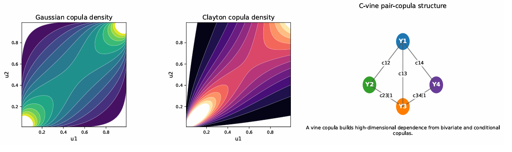
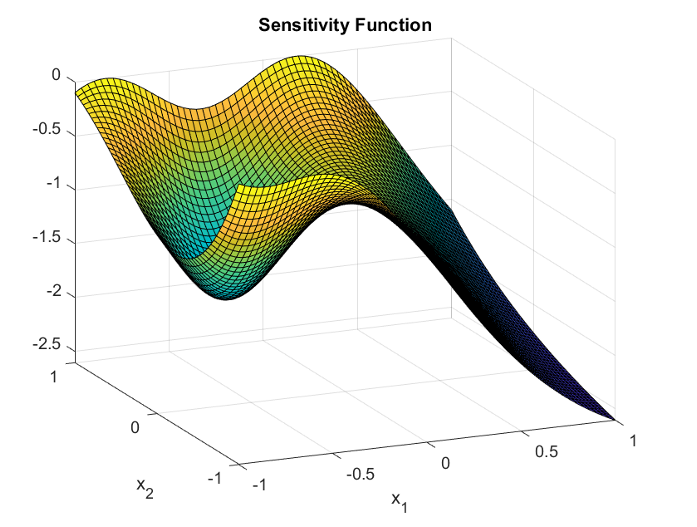

# CSOMA MATLAB Package

<p align="center">
  <strong>MATLAB package for competitive swarm optimization with mutated agents, derivative-free optimization, and optimal design applications.</strong>
</p>

<p align="center">
  <a href="#quickstart">Quickstart</a> |
  <a href="#what-it-does">What it does</a> |
  <a href="#application-highlights">Application highlights</a> |
  <a href="#examples">Examples</a> |
  <a href="#api-map">API map</a> |
  <a href="#background">Background</a>
</p>

<p align="center">
  
  
  
  
</p>

---

## Overview

CSOMA is a MATLAB package built around `csoma`, an implementation of the competitive swarm optimizer with mutated agents (CSO-MA). It is designed for derivative-free optimization over box constraints and includes runnable applications in optimal design, dependence modeling, Wasserstein regression, Riemannian optimization, and combinatorial search.

It provides:

- a box-constrained swarm optimizer with a simple row-vector objective interface;
- a fast package-level smoke-test script;
- runnable examples spanning logistic design, Gaussian copula design and pseudo-likelihood estimation, Wasserstein regression, Riemannian design, and travelling salesman optimization;
- heavier reference examples for Bayesian HIV design, high-dimensional D-optimal design, and fractional polynomial design;
- supporting documentation, example materials, and packaging notes.

At the core, `csoma` minimizes a scalar objective function over lower and upper box constraints using pairwise competition, swarm-center attraction, and a mutation step that helps the search escape stagnation.

## What It Does

| Layer | Main files | Purpose |
| --- | --- | --- |
| Core optimizer | [`src/csoma.m`](src/csoma.m) | Minimize a scalar objective over box constraints using the CSO-MA update rule with optional seeded reproducibility and iteration history. |
| Path helper | [`src/csoma_addpaths.m`](src/csoma_addpaths.m) | Add the package source and example directories to the MATLAB path after `src/` is available. |
| Fast replication | [`replication/run_all.m`](replication/run_all.m) | Run the lightweight end-to-end example suite intended for quick package verification. |
| Design examples | [`examples/logistic_design/`](examples/logistic_design), [`examples/copula_design/`](examples/copula_design), [`examples/riemannian_design/`](examples/riemannian_design) | Show how CSOMA can optimize approximate designs in Euclidean and manifold settings. |
| Statistical estimation examples | [`examples/wasserstein_regression/`](examples/wasserstein_regression), [`examples/bayesian_hiv/`](examples/bayesian_hiv) | Use CSOMA as a derivative-free optimizer inside estimation and Bayesian design objectives. |
| Combinatorial example | [`examples/tsp/`](examples/tsp) | Solve a travelling salesman instance through a continuous random-key encoding. |

## Application Highlights

The package can be used as a general-purpose box-constrained optimizer, and the bundled examples show how the same interface extends naturally to statistical computing and experimental design tasks.

The logistic-design example includes a sensitivity-function diagnostic that helps assess the resulting approximate design:

<p align="center">
  
</p>

<p align="center">
  <em>Figure 1: The sensitivity function of design.</em>
</p>

The copula examples illustrate both optimization and dependence modeling use cases, from Gaussian copula design through pseudo-likelihood estimation and higher-dimensional structured dependence:

<p align="center">
  
</p>

<p align="center">
  <em>Figure 2: Illustrative copula dependence structures. The left and middle panels show contour plots of Gaussian and Clayton copula densities on the unit square. The right panel sketches a four-variable C-vine in which high-dimensional dependence is built from pair-copula components.</em>
</p>

## Quickstart

Recommended environment: MATLAB with base functionality. Some advanced examples additionally use Statistics and Machine Learning Toolbox routines such as `mvnrnd`, `wishrnd`, `gamrnd`, and `normrnd`.

From MATLAB, move to the repository root and run:

```matlab
cd('path/to/CSOMA')
addpath('src')
csoma_addpaths
run(fullfile('replication', 'run_all.m'))
```

The fast replication script runs:

1. the basic smoke test;
2. the logistic D-optimal design example;
3. the Gaussian copula design example;
4. the Gaussian copula maximum pseudo-likelihood example;
5. the Wasserstein regression example;
6. the Riemannian sphere design example;
7. the travelling salesman example.

The heavier examples under `examples/high_dim_d_optimal`, `examples/bayesian_hiv`, and `examples/fractional_polynomial` should be run separately.

## Minimal API Example

```matlab
obj_fun = @(x) sum((x - [0.25, -0.50, 0.75]).^2);
lb = -ones(1, 3);
ub = ones(1, 3);
swarmsize = 24;
phi = 0.10;
maxiter = 80;
opts = struct('Seed', 1, 'Display', false);

[best_value, best_x, history] = csoma(obj_fun, lb, ub, swarmsize, phi, maxiter, opts);

fprintf('Best value: %.8g\n', best_value);
fprintf('Best x: [%s]\n', num2str(best_x, ' %.4f'));
fprintf('Initial best: %.8g, final best: %.8g\n', history(1), history(end));
```

`csoma` expects:

- `obj_fun`: a function handle that accepts one row vector and returns one scalar objective value;
- `lb`, `ub`: row vectors of lower and upper bounds;
- `swarmsize`, `phi`, `maxiter`: optimizer controls;
- `opts`: optional settings such as `Seed` and `Display`.

## Examples

| Command | Output |
| --- | --- |
| `run('examples/basic/run_basic.m')` | Verifies package setup with a small quadratic smoke test and prints the best solution found. |
| `run('examples/logistic_design/run_logistic_design.m')` | Computes a locally D-optimal approximate design for a two-factor logistic model and reports the design matrix and sensitivity. |
| `run('examples/copula_design/run_copula_design.m')` | Optimizes a Gaussian copula design and prints support points with normalized weights. |
| `run('examples/copula_design/run_copula_mle.m')` | Estimates the Gaussian copula dependence parameter by minimizing a pseudo-likelihood objective. |
| `run('examples/wasserstein_regression/run_wasserstein_regression.m')` | Fits a simple Wasserstein regression objective and compares true versus estimated parameters. |
| `run('examples/riemannian_design/run_riemannian_sphere_design.m')` | Computes a D-optimal design on the sphere and prints support points in Cartesian coordinates. |
| `run('examples/tsp/run_tsp.m')` | Solves a small travelling salesman instance and prints the final route length and tour. |
| `run('examples/high_dim_d_optimal/run_glm_fisher.m')` | Runs a heavier high-dimensional D-optimal design example adapted from the reference repository. |
| `run('examples/bayesian_hiv/run_hiv_demo.m')` | Runs a reduced Bayesian HIV design example with deliberately small Monte Carlo settings for package checking. |
| `run('examples/fractional_polynomial/run_fractional.m')` | Contains reference fractional polynomial design code from the source repository for separate exploratory use. |

Most scripts print numerical summaries directly to the MATLAB command window. The fast starter scripts are intentionally lightweight, while the heavier examples show broader application coverage and reference workflows.

## API Map

### Core Functions

| Symbol | Role |
| --- | --- |
| `csoma` | Main optimizer. Returns the best objective value, best parameter vector, and optionally the iteration history. |
| `csoma_addpaths` | Convenience helper to add `src/` and the example tree to the MATLAB path. |

### `csoma` Inputs

| Argument | Meaning |
| --- | --- |
| `obj_fun` | Objective function handle taking one row vector and returning one scalar. |
| `lb`, `ub` | Lower and upper box bounds with equal length. |
| `swarmsize` | Number of swarm particles; must be at least 2. |
| `phi` | Swarm-center attraction parameter used in loser updates. |
| `maxiter` | Number of optimization iterations. |
| `opts.Display` | When `true`, prints per-iteration progress. |
| `opts.Seed` | Optional numeric seed passed to `rng` for reproducibility. |

### `csoma` Outputs

| Output | Meaning |
| --- | --- |
| `minf` | Best objective value found. |
| `minx` | Best feasible solution vector found. |
| `history` | Best-so-far objective value at iteration 0 through `maxiter`. |

## Repository Layout

```text
CSOMA/
|-- assets/
|   |-- figure1.png                 # Sensitivity function figure
|   `-- figure2.png                 # Copula dependence structure figure
|-- docs/
|   |-- manuscript_code_fragments/   # Code fragments aligned with the manuscript draft
|   |-- MATLAB_FILE_EXCHANGE_SUBMISSION.md
|   `-- original_github_README.md
|-- examples/
|   |-- basic/                       # Small smoke test
|   |-- bayesian_hiv/               # Reduced Bayesian design example
|   |-- copula_design/              # Copula design and pseudo-likelihood estimation
|   |-- fractional_polynomial/      # Reference design code from source repository
|   |-- high_dim_d_optimal/         # Higher-cost D-optimal design example
|   |-- logistic_design/            # Two-factor logistic design
|   |-- riemannian_design/          # Design on the sphere
|   |-- tsp/                        # Travelling salesman example
|   `-- wasserstein_regression/     # Distributional regression example
|-- replication/
|   `-- run_all.m                   # Fast package verification script
|-- src/
|   |-- csoma.m                     # Core optimizer
|   `-- csoma_addpaths.m            # MATLAB path helper
|-- CITATION.cff
|-- LICENSE
|-- MANIFEST.md
`-- README.md
```

## Background

This repository packages the CSO-MA optimizer as a reusable MATLAB tool with application-driven examples. It combines a compact optimization interface with end-to-end scripts so users can both call `csoma` directly and study complete problem-specific workflows.

In that sense:

- the optimizer design is grounded in the CSO-MA algorithmic framework;
- `src/csoma.m` supplies the reusable optimizer implementation;
- `replication/run_all.m` supplies a fast package entry point;
- the example directories supply domain-specific objective functions and runnable demonstrations.

The local package was prepared using the public reference repository [`ElvisCuiHan/CSOMA`](https://github.com/ElvisCuiHan/CSOMA), with the source snapshot noted in the existing project documentation.

## Requirements

- Core optimizer: base MATLAB only.
- Some advanced examples: Statistics and Machine Learning Toolbox.
- No external package manager or compiled dependency is required for the core workflow.

## Notes

- The basic and replication scripts are the best starting point for a quick correctness check.
- The high-dimensional, Bayesian HIV, and fractional polynomial examples are more computationally demanding or more directly inherited from the reference repository.
- The package is distributed under the MIT License.
- `MANIFEST.md` lists the packaged project contents.
